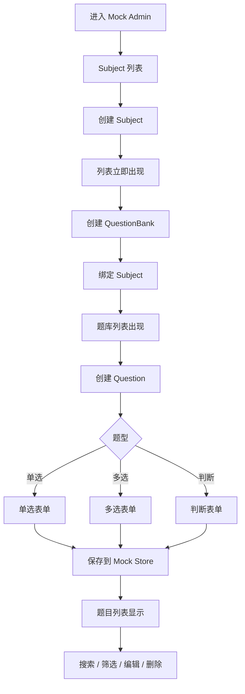

# QandA 管理端 Independent MVP PRD

## 1. 文档目标

本文档定义 QandA React 管理端的独立 MVP 范围、内容管理交互闭环、Admin Playground / Mock 数据机制和技术架构。

本阶段核心目标不是完成与 Spring Boot 的真实数据联调，而是：

> 在纯前端 Mock 环境中验证管理员能够完整完成“科目 → 题库 → 题目”的内容管理闭环。

---

## 2. Independent MVP 定义

管理端独立 MVP：

```text
管理员进入测试 Admin
→ 创建科目
→ 列表立即显示
→ 创建题库
→ 题库归属科目
→ 列表立即显示
→ 创建三种题型
→ 搜索 / 筛选
→ 编辑
→ 删除 / 停用
→ 验证完整交互闭环
```

所有“后端行为”由：

```text
MockAdminGateway
+
Playground Store
```

模拟。

联调阶段替换为：

```text
HttpAdminGateway
```

正式页面和 Form 不重写。

---

## 3. 产品目标

1. 验证后台信息架构和操作流程。
2. 验证科目、题库、题目的 CRUD 体验。
3. 验证题目编辑器对三种题型是否足够。
4. 验证 Arco Design Pro 风格是否适合 QandA。
5. 验证搜索、筛选、空状态、失败状态。
6. 为后续真实 API 联调建立稳定的前端边界。

---

## 4. MVP 功能范围

### 4.1 Mock 登录

MVP 可以使用固定测试管理员：

```text
admin / mock
```

或点击“进入 Playground Admin”。

只需要验证：

- 登录页；
- 登录成功跳转；
- 未登录保护。

不要求真实 Spring Security 联调。

### 4.2 科目管理

支持：

- 列表；
- 创建；
- 编辑；
- 启用 / 停用；
- 搜索；
- 空状态。

### 4.3 题库管理

支持：

- 列表；
- 创建；
- 编辑；
- 删除 / 停用；
- 绑定科目；
- 显示题目数量；
- 按科目筛选。

### 4.4 题目管理

支持：

- 列表；
- 创建；
- 编辑；
- 查看；
- 删除 / 停用；
- 搜索；
- 按题库筛选；
- 按题型筛选。

题型：

```text
SINGLE_CHOICE
MULTIPLE_CHOICE
TRUE_FALSE
```

题目字段：

```text
stem
type
options
correctAnswer
explanation
questionBankId
status
```

---

## 5. 管理端交互闭环



这个流程就是 Admin 端 MVP 的主要验收闭环。

---

## 6. 页面范围

```text
src/pages/
├── login/
├── dashboard/
├── subjects/
├── question-banks/
└── questions/
```

### Dashboard

只展示 Mock 数据概览：

- 科目数；
- 题库数；
- 题目数。

不做 BI。

### Subjects

典型：

```text
列表
→ 创建 Drawer / Modal
→ 保存
→ 列表更新
→ 编辑
```

### QuestionBanks

典型：

```text
筛选 Subject
→ 创建题库
→ 绑定 Subject
→ 保存
→ 列表更新
```

### Questions

典型：

```text
选择题型
→ 动态表单
→ 校验
→ 保存
→ 列表出现
→ 搜索 / 编辑 / 删除
```

---

## 7. Playground

建议：

```text
apps/admin/
├── src/
└── playground/
    ├── fixtures/
    │   ├── subjects.ts
    │   ├── question-banks.ts
    │   └── questions.ts
    ├── store/
    │   └── mock-admin-store.ts
    ├── gateways/
    │   └── mock-admin-gateway.ts
    └── scenarios/
        ├── normal.ts
        ├── empty.ts
        ├── error.ts
        └── large-data.ts
```

Playground 可直接模拟：

```text
0 个科目
已有 5 个科目
空题库
创建成功
创建失败
删除失败
500ms / 3s 请求延迟
1000 道题
```

---

## 8. 技术架构

### 技术选型

```text
React
TypeScript
Vite
React Router
TanStack Query
Zustand
@arco-design/web-react
```

视觉参考：

```text
arco-design-pro-vue
arco-design-pro
```

代码保持 React，不引入 Vue。

---

## 9. Arco Pro 风格要求

MVP 主要验证：

```text
Sidebar
Header
Breadcrumb
Page Header
Card
Table
Form
Drawer
Modal
Empty
Result
```

建议布局：

```text
AdminLayout
├── Sidebar
├── Header
├── Breadcrumb
└── PageContent
```

风格保持：

- 清晰；
- 简洁；
- 信息密度适中；
- 统一表格；
- 统一 Form；
- 统一状态反馈。

---

## 10. Mock / HTTP 可替换架构

定义：

```ts
interface AdminContentGateway {
  listSubjects(): Promise<Subject[]>
  createSubject(input: CreateSubjectInput): Promise<Subject>

  listQuestionBanks(query?: Query): Promise<QuestionBank[]>
  createQuestionBank(input: CreateQuestionBankInput): Promise<QuestionBank>

  listQuestions(query?: Query): Promise<Question[]>
  createQuestion(input: CreateQuestionInput): Promise<Question>
}
```

MVP：

```text
MockAdminContentGateway
```

联调：

```text
HttpAdminContentGateway
```

React 页面只依赖接口，不依赖具体实现。

---

## 11. TanStack Query 的使用

即使是 Mock 数据，也建议走：

```text
React Page
    ↓
TanStack Query
    ↓
AdminContentGateway
    ↓
Mock Store
```

这样创建题库之后仍然按照真实产品模式：

```text
mutation
→ success
→ invalidate query
→ 列表重新读取
```

而不是组件直接修改数组。

这样联调时前端行为几乎不用变。

---

## 12. Zustand 的使用

仅处理：

- Sidebar；
- Theme；
- 管理端少量 UI 状态。

CRUD 业务数据由 Query + Gateway 管理。

---

## 13. 表单业务规则

### Subject

至少：

```text
name 必填
status 必填
```

### QuestionBank

至少：

```text
subjectId 必填
name 必填
status 必填
```

### 单选题

- 至少两个选项；
- 只能一个正确答案。

### 多选题

- 至少两个选项；
- 至少两个正确选项。

### 判断题

- 答案为 True / False。

### 所有题目

- 题干必填；
- 正确答案合法；
- MVP 建议解析必填。

---

## 14. MVP 不要求

本阶段不要求：

- Spring Boot 真请求；
- PostgreSQL；
- 真管理员账号；
- 真 RBAC；
- 用户管理；
- 教师角色；
- 统计大屏；
- 审计；
- AI；
- 批量导入；
- 复杂审批。

---

## 15. MVP 验收标准

在完全没有后端的情况下，管理员必须可以：

```text
进入 Admin
→ 创建 Subject
→ 创建 QuestionBank
→ 创建三种题型
→ 搜索
→ 筛选
→ 编辑
→ 删除 / 停用
```

并且：

- 所有列表会正确刷新；
- 创建成功有反馈；
- 创建失败有反馈；
- Empty 状态正常；
- Loading 状态正常；
- Form 校验正常；
- 1000 条 Mock 题目时页面仍可操作。

### 架构验收

- React 页面不直接操作 Mock Store；
- 页面不出现 `if mockMode`；
- Query 调用统一 Gateway；
- Mock Gateway 可以被 HTTP Gateway 无缝替换。

---

## 16. MVP 后续联调

Admin Independent MVP 完成后：

```text
MockAdminContentGateway
        ↓
替换
        ↓
HttpAdminContentGateway
        ↓
Spring Boot
```

同时：

1. 接入 OpenAPI Generated Contract；
2. 替换 Mock DTO；
3. 接入真实错误码；
4. 接入 Spring Security 登录；
5. 保留 Playground 作为交互测试环境。

联调不应重写页面、表格、Form 和核心交互流程。
