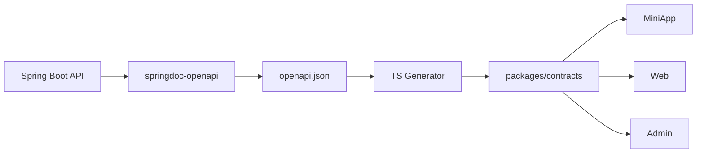

# QandA 后端 API Independent MVP PRD

## 1. 文档目标

本文档定义 QandA Spring Boot + Kotlin 后端的独立 MVP 范围、API 自身业务闭环、测试入口和技术架构。

与 MiniApp / Web / Admin 不同：

> 后端自身就是业务事实中心，因此 API MVP 不应该使用 Mock 数据库替代核心业务。

后端 Independent MVP 应通过：

```text
Swagger UI / HTTP Client / Integration Tests
+
Spring Boot
+
真实 PostgreSQL / Testcontainers PostgreSQL
```

独立完成自身闭环。

前端联调不属于本阶段验收条件。

---

## 2. Independent MVP 定义

后端 MVP 必须在没有任何真实前端的情况下完成：

```text
创建 Subject
→ 创建 QuestionBank
→ 创建 Questions
→ 查询用户可用题库
→ 创建 PracticeSession
→ 返回固定题目集合与顺序
→ 提交完整 Session
→ 服务端判题
→ 生成 PracticeResult
→ 查询 Result
```

测试入口：

- Swagger UI；
- IntelliJ HTTP Client / curl；
- Integration Tests；
- Seed Data。

---

## 3. 产品目标

1. 建立 QandA MVP 的业务事实中心。
2. 建立内容供给闭环。
3. 建立 PracticeSession → Submission → PracticeResult 闭环。
4. 保证最终成绩由服务端计算。
5. 保证重复提交幂等。
6. 形成稳定 OpenAPI Contract，供三个前端后续联调。
7. 不依赖 MiniApp / Web / Admin 的开发进度。

---

## 4. 核心领域

```text
User
Subject
QuestionBank
Question
PracticeSession
PracticeSubmission
PracticeResult
```

---

## 5. 内容供给闭环

通过 Swagger / HTTP Client：

```text
POST Subject
→ POST QuestionBank
→ POST Questions
→ GET Subjects
→ GET QuestionBanks
```

必须可以在没有 Admin 前端的情况下完整验证。

---

## 6. Practice 闭环

```mermaid
flowchart TD
    A[HTTP Client] --> B[POST /practice-sessions]
    B --> C[校验题库和题量]
    C --> D[固定 questionIds / questionOrder]
    D --> E[返回 PracticeSession]
    E --> F[POST /practice-sessions/{id}/submit]
    F --> G[校验 Submission]
    G --> H[服务端判题]
    H --> I[生成 PracticeResult]
    I --> J[Session 标记 SUBMITTED]
    J --> K[GET Result]
```

---

## 7. MVP 功能范围

### 7.1 Subject

支持：

- 创建；
- 修改；
- 查询；
- 启用 / 停用。

### 7.2 QuestionBank

支持：

- 创建；
- 修改；
- 查询；
- 绑定 Subject；
- 启用 / 停用。

### 7.3 Question

支持：

- 单选；
- 多选；
- 判断；
- 创建；
- 修改；
- 查询；
- 删除或停用。

### 7.4 PracticeSession

支持：

- 指定题量；
- 顺序；
- 随机；
- 固化题目集合；
- 固化题序；
- 创建 Session；
- 查询 Session。

### 7.5 Submission

支持：

- 完整 Session 一次性提交；
- 未答题；
- 多选；
- 判断；
- 服务端最终判题；
- 重复提交幂等。

### 7.6 PracticeResult

支持：

```text
totalCount
answeredCount
correctCount
wrongCount
unansweredCount
accuracy
duration
questionResults
```

每题至少返回：

```text
questionId
userAnswer
correctAnswer
status
explanation
```

---

## 8. 推荐 API

### 用户侧

```http
GET  /api/subjects
GET  /api/subjects/{subjectId}/question-banks

POST /api/practice-sessions
GET  /api/practice-sessions/{sessionId}
POST /api/practice-sessions/{sessionId}/submit
GET  /api/practice-sessions/{sessionId}/result
```

### Admin 侧

```http
GET    /api/admin/subjects
POST   /api/admin/subjects
PUT    /api/admin/subjects/{id}

GET    /api/admin/question-banks
POST   /api/admin/question-banks
PUT    /api/admin/question-banks/{id}

GET    /api/admin/questions
POST   /api/admin/questions
GET    /api/admin/questions/{id}
PUT    /api/admin/questions/{id}
DELETE /api/admin/questions/{id}
```

路径在开发中可微调，但资源边界应保持稳定。

---

## 9. Session 规则

创建 Session 时：

1. 校验 Subject；
2. 校验 QuestionBank；
3. 校验题量；
4. 选择题目；
5. 确定顺序；
6. 保存 `questionIds`；
7. 保存 `questionOrder`；
8. 返回 Session。

随机 Session 创建完成后不得重新随机。

MVP 建议：

> 同一用户同一题库最多一个 ACTIVE Session。

---

## 10. Submission 规则

客户端只能提交：

```text
sessionId
answers
elapsedTime
```

不能把：

```text
correctCount
wrongCount
accuracy
```

作为最终事实提交。

最终结果全部由 Kotlin 后端重新计算。

---

## 11. 幂等

必须保证：

```text
同一个 PracticeSession
→ 只能生成一个最终 PracticeResult
```

典型：

```text
第一次提交已成功
→ 客户端超时
→ 再次提交
→ 返回原 Result
```

不能重复生成成绩。

---

## 12. 技术架构

### 技术选型

```text
Spring Boot
Kotlin
JDK 21
Gradle Kotlin DSL
Spring MVC
Spring Data JPA
Hibernate
PostgreSQL
Flyway
Spring Security
Jakarta Validation
springdoc-openapi
JUnit 5
MockK
Testcontainers
```

MVP 不使用 WebFlux。

---

## 13. 模块结构

```text
apps/api/src/main/kotlin/.../
├── auth/
├── subject/
├── questionbank/
├── question/
├── practice/
├── result/
└── common/
```

Feature First。

例如：

```text
practice/
├── PracticeController.kt
├── PracticeService.kt
├── PracticeSession.kt
├── PracticeSubmission.kt
├── PracticeRepository.kt
└── PracticeMapper.kt
```

---

## 14. 分层原则

```text
Controller
    ↓
Application Service
    ↓
Domain
    ↓
Repository
    ↓
PostgreSQL
```

核心业务不能全部写在 Controller。

---

## 15. 数据库

MVP 最少：

```text
users
subjects
question_banks
questions
question_options
practice_sessions
practice_answers
practice_results
```

Schema 必须通过 Flyway 管理。

```text
db/migration/
├── V001__init.sql
├── V002__question_bank.sql
└── V003__practice_session.sql
```

---

## 16. API Playground

后端自己的 Playground 不需要再开发一个业务前端。

推荐：

### Swagger UI

人工：

```text
创建 Subject
→ 创建 QuestionBank
→ 创建 Question
→ 创建 Session
→ Submit
→ 查询 Result
```

### HTTP Client

仓库可提供：

```text
apps/api/http/
├── admin.http
├── practice.http
└── result.http
```

### Seed Data

提供：

```text
dev seed
```

快速生成：

- 1~3 个科目；
- 数个题库；
- 三种题型。

### Integration Tests

通过 Testcontainers PostgreSQL 自动跑核心闭环。

---

## 17. OpenAPI Contract

API Independent MVP 的重要交付物之一就是：

```text
openapi.json
```

它会成为下一阶段：

```text
Kotlin
↕
TypeScript
```

的契约中心。

流程：



在 Independent MVP 阶段先保证 Contract 结构稳定，不要求前端立即使用。

---

## 18. 测试范围

### Question

验证：

- 单选只能一个正确答案；
- 多选至少两个正确答案；
- 判断题答案合法。

### PracticeSession

验证：

- 题数正确；
- 随机不重复；
- 题序固定；
- 无效题库失败；
- 题量超过可用数量失败。

### Submission

验证：

- 正常提交；
- 未答；
- 错答；
- 多选顺序无关；
- 重复提交。

### Result

验证：

- correctCount；
- wrongCount；
- unansweredCount；
- accuracy；
- questionResults。

---

## 19. 外部依赖 Mock 原则

后端核心业务和数据库不 Mock。

可以 Mock 的只有真正外部系统，例如未来：

```text
微信 code2session
```

Independent MVP 阶段可以使用：

```text
DevAuthProvider
```

模拟用户身份。

后续联调 / 上线前替换为：

```text
WechatAuthProvider
```

---

## 20. MVP 不做

本阶段不要求：

- MiniApp 联调；
- Web 联调；
- Admin 联调；
- 真微信登录；
- Redis；
- Kafka；
- RabbitMQ；
- Elasticsearch；
- 微服务；
- 复杂 RBAC；
- 多租户；
- AI；
- 支付；
- 排行榜。

保持模块化单体。

---

## 21. MVP 验收标准

### 内容闭环

仅通过 Swagger / HTTP Client：

```text
创建 Subject
→ 创建 QuestionBank
→ 创建三种题型
→ 查询成功
```

### Practice 闭环

```text
创建 Session
→ 获得固定题目
→ 提交答案
→ 服务端判题
→ 获得 Result
```

### 可靠性

必须保证：

- 随机 Session 题序固定；
- 重复提交幂等；
- Result 只有一份；
- 最终判题由服务端完成；
- Flyway 可从空库初始化；
- Integration Test 可独立运行。

### 契约

必须：

- 能生成 OpenAPI；
- DTO 命名稳定；
- 错误响应统一；
- 为后续 TypeScript 生成提供可用 Contract。

---

## 22. Independent MVP 结束后的联调阶段

后端 MVP 完成后进入：

```text
Contract Freeze
→ 生成 packages/contracts
→ 前端替换 Mock Gateway
→ Integration
→ E2E
```

联调目标不是再重做业务，而是验证：

```text
前端已经验证的交互闭环
+
后端已经验证的业务闭环
```

能否通过同一 OpenAPI Contract 正确连接。
