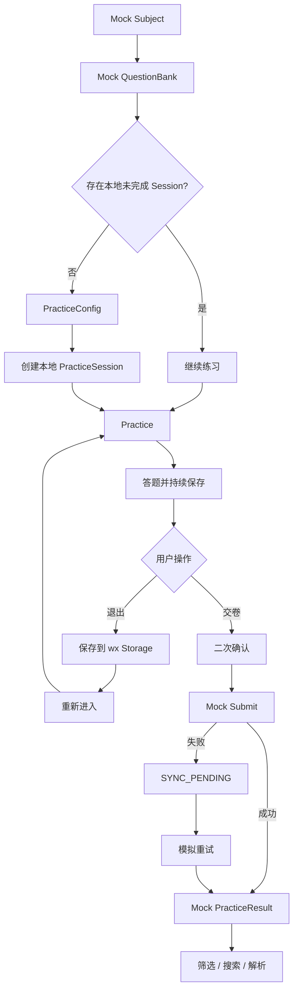

# QandA 微信小程序端 Independent MVP PRD

## 1. 文档目标

本文档定义 QandA 微信原生小程序端的独立 MVP 范围、端内业务闭环、Playground / Mock 机制和技术架构。

本阶段的目标不是与真实后端完成联调，而是：

> 在不依赖 Spring Boot API 的情况下，独立验证小程序端完整刷题体验、PracticeSession 运行、本地持久化、异常恢复、提交交互和结果复盘。

联调属于下一阶段，不作为本端 MVP 的验收前提。

---

## 2. Independent MVP 定义

小程序端 MVP 必须独立完成：

```text
Mock 科目
→ Mock 题库
→ 练习配置
→ 创建本地 PracticeSession
→ 完成答题
→ 本地持续保存
→ 退出 / 异常关闭
→ 恢复 Session
→ Mock 提交
→ Mock PracticeResult
→ 结果复盘
```

外部依赖统一通过可替换 Adapter / Gateway 模拟。

MVP 结束后，不重写页面和业务流程，只需要：

```text
MockPracticeGateway
        ↓
替换为
        ↓
HttpPracticeGateway
```

即可进入联调。

---

## 3. 产品目标

1. 验证微信原生小程序能否承载完整练习流程。
2. 验证单选、多选、判断三种题型的交互。
3. 验证 PracticeSession 在小程序内的运行与状态管理。
4. 验证本地持久化和异常退出恢复。
5. 验证提交、失败提示、结果页、筛选和解析等完整用户体验。
6. 保证 MVP 完成后可平滑替换为真实 API，而不推翻前端结构。

---

## 4. MVP 功能范围

### 4.1 练习入口

支持：

- 科目选择；
- 题库选择；
- 未完成 PracticeSession 检测；
- 继续练习；
- 开始新练习。

MVP 数据由 Mock 数据源提供。

### 4.2 练习配置

支持：

- 答题数量配置；
- 顺序 / 随机出题；
- 立即反馈 / 统一反馈；
- 自动下一题；
- 不计时 / 练习计时。

### 4.3 题型

支持：

- 单选；
- 多选；
- 判断。

多选题必须有“确认答案”行为。

### 4.4 练习过程

支持：

- 上一题；
- 下一题；
- 答题卡跳题；
- 当前题；
- 已答；
- 未答；
- 自动下一题；
- 立即反馈；
- 统一反馈。

### 4.5 本地持久化与恢复

支持：

- 答题后持续本地保存；
- 主动退出保存；
- 异常退出恢复；
- 恢复原题目集合；
- 恢复原题序；
- 恢复答案；
- 恢复当前位置；
- 恢复答题状态；
- 恢复计时信息。

### 4.6 Mock 提交

支持：

- 交卷二次确认；
- 未答题数量提示；
- 模拟提交成功；
- 模拟提交失败；
- 提交失败进入 `SYNC_PENDING`；
- 模拟重试成功。

### 4.7 结果复盘

支持：

- 结果总览；
- 错题列表；
- 全部题目；
- 正确 / 错误 / 未答筛选；
- 题干 + 选项搜索；
- 题目详情；
- 用户答案；
- 正确答案；
- 解析。

---

## 5. 页面范围

```text
pages/
├── subject-list
├── question-bank-list
├── practice-config
├── practice
├── answer-sheet
├── practice-result
└── question-detail
```

MVP 页面必须可独立运行，不依赖真实后端。

---

## 6. 端内业务闭环



---

## 7. Playground / Mock 设计

建议：

```text
apps/miniapp/
├── miniprogram/
│   ├── pages/
│   ├── components/
│   ├── stores/
│   ├── services/
│   └── repositories/
└── playground/
    ├── fixtures/
    │   ├── subjects.ts
    │   ├── question-banks.ts
    │   ├── questions.ts
    │   └── results.ts
    ├── scenarios/
    │   ├── normal.ts
    │   ├── half-completed.ts
    │   ├── submit-failed.ts
    │   └── empty.ts
    └── mock-gateways/
```

Playground 至少能够模拟：

- 正常题库；
- 空题库；
- 练习完成一半；
- 全部未答；
- 提交成功；
- 提交失败；
- 网络延迟；
- 100 道题压力场景。

Playground 属于开发工具，不进入生产版本。

---

## 8. 技术架构

### 技术选型

```text
微信原生小程序
TypeScript
WXML
WXSS
MobX MiniProgram
TDesign MiniProgram（按需）
```

### 核心结构

```text
Page / Component
        ↓
      Store
        ↓
 Practice UseCase
        ↓
PracticeGateway / Repository
      ↙          ↘
Mock Adapter   Wx Storage Adapter
```

### API 边界

定义统一接口，例如：

```ts
interface PracticeGateway {
  getSubjects(): Promise<Subject[]>
  getQuestionBanks(subjectId: string): Promise<QuestionBank[]>
  createSession(input: CreateSessionInput): Promise<PracticeSession>
  submitSession(input: SubmitSessionInput): Promise<PracticeResult>
}
```

MVP：

```text
MockPracticeGateway
```

联调：

```text
HttpPracticeGateway
```

页面和 Store 不感知当前使用 Mock 还是真实 HTTP。

---

## 9. PracticeSession 核心状态

至少包含：

```text
sessionId
subjectId
questionBankId
config
questionIds
questionOrder
currentIndex
answers
questionStates
elapsedTime
status
syncStatus
```

业务状态：

```text
IN_PROGRESS
PAUSED
SUBMITTED
```

同步状态：

```text
LOCAL_ONLY
SYNC_PENDING
SYNCING
SYNCED
SYNC_FAILED
```

---

## 10. MVP 不要求

本阶段不要求：

- Spring Boot 联调；
- 微信正式登录；
- 真 OpenAPI Contract；
- 真服务端 Session；
- 真服务端判题；
- 跨设备同步；
- 排行榜；
- 收藏；
- 错题本；
- AI；
- 支付；
- 社交。

---

## 11. MVP 验收标准

### 产品闭环

在完全关闭真实 API 的情况下，用户仍能：

```text
选科目
→ 选题库
→ 创建练习
→ 答题
→ 退出
→ 恢复
→ 交卷
→ 查看结果
→ 查看解析
```

### 交互

必须验证：

- 单选；
- 多选；
- 判断；
- 上下题；
- 答题卡；
- 自动下一题；
- 两种反馈模式；
- 提交成功 / 失败；
- 结果筛选与搜索。

### 可靠性

必须验证：

- 刷新 / 重新打开后答案不丢；
- 题序不变；
- currentIndex 可恢复；
- Mock 提交失败不会清除 Session；
- Mock 重试成功后能进入 Result。

### 架构

必须满足：

- Page 不直接写死 Mock；
- Page 不直接调用 `wx.request`；
- Mock 与 HTTP 通过统一 Gateway 边界切换；
- 本地存储通过 Repository 封装。

---

## 12. MVP 结束后的联调入口

Independent MVP 完成后，只需要：

1. 冻结 OpenAPI Contract；
2. 生成 TypeScript DTO；
3. 实现 `HttpPracticeGateway`；
4. 将依赖注入从 Mock 切换为 HTTP；
5. 保留 Playground 用于后续交互回归；
6. 开始真实后端联调。

联调不应要求重新设计小程序页面和 PracticeSession 流程。
