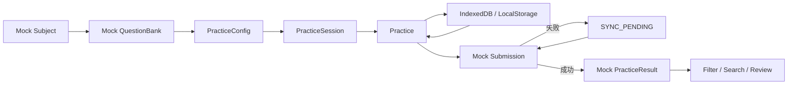

# QandA 用户 Web 端 Independent MVP PRD

## 1. 文档目标

本文档定义 QandA 用户 Web 端的独立 MVP 范围、浏览器内业务闭环、Playground / Mock 机制和 React 技术架构。

本阶段不依赖真实 Spring Boot 后端。

目标是先证明：

> QandA 的完整刷题体验在浏览器端能够独立成立。

---

## 2. Independent MVP 定义

Web 端必须在 Mock API 下完整跑通：

```text
Mock Subject
→ Mock QuestionBank
→ PracticeConfig
→ PracticeSession
→ 答题
→ 本地保存
→ 浏览器刷新 / 关闭
→ 恢复
→ Mock Submission
→ Mock PracticeResult
→ 筛选 / 搜索 / 解析
```

外部依赖通过 Adapter / Mock Transport 模拟。

联调阶段只替换：

```text
MockPracticeGateway
→ HttpPracticeGateway
```

React 页面、Feature、Store 和用户流程不重写。

---

## 3. 产品目标

1. 验证 PC / 浏览器环境下完整刷题体验。
2. 验证 PracticeSession 在浏览器端持续运行。
3. 验证刷新、重新打开页面后的 Session 恢复。
4. 验证结果页大屏复盘体验。
5. 验证 React 状态边界与 Server State / Client State 分工。
6. 验证未来接入真实 API 时不需要修改核心业务页面。

---

## 4. MVP 功能范围

### 4.1 练习准备

支持：

- 科目选择；
- 题库选择；
- 未完成 Session 检测；
- 继续练习；
- 答题数量；
- 顺序 / 随机；
- 立即反馈 / 统一反馈；
- 自动下一题；
- 不计时 / 练习计时。

### 4.2 练习

支持：

- 单选；
- 多选；
- 判断；
- 上一题；
- 下一题；
- 答题卡；
- 当前 / 已答 / 未答；
- 自动下一题；
- 两种反馈模式。

### 4.3 本地恢复

支持：

- 自动保存；
- 主动退出保存；
- 页面刷新恢复；
- 浏览器重新打开恢复；
- 题序保持；
- 当前题恢复；
- 答案恢复；
- 计时恢复。

### 4.4 Mock 提交

支持：

- 二次确认；
- 未答提示；
- 模拟成功；
- 模拟失败；
- `SYNC_PENDING`；
- 模拟重试。

### 4.5 Result

支持：

- 总览；
- 错题；
- 全部题目；
- 正确 / 错误 / 未答筛选；
- 题干 + 选项搜索；
- 题目详情；
- 正确答案；
- 用户答案；
- 解析。

---

## 5. 页面范围

```text
src/pages/
├── subjects/
├── question-banks/
├── practice-config/
├── practice/
├── practice-result/
└── question-detail/
```

建议 Practice 页面充分利用桌面空间：

```text
┌─────────────────────────────────────┐
│ Header / Progress / Timer           │
├─────────────────────────┬───────────┤
│ Question + Options      │ Answer    │
│                         │ Sheet     │
│                         │           │
├─────────────────────────┴───────────┤
│ Previous / Next / Submit            │
└─────────────────────────────────────┘
```

---

## 6. 端内闭环



---

## 7. Playground

建议开发独立：

```text
/playground
```

或独立入口：

```text
apps/web/playground/
```

提供场景按钮：

```text
正常练习
答了一半
全部未答
全部答完
提交失败
网络延迟 3s
Result 空数据
100 道题
解析超长
```

点击场景后可以直接进入正式 Practice / Result 页面。

Playground 的作用是：

- 快速测试交互；
- 测试边界状态；
- 测试异常状态；
- 验证 UI；
- 后续回归。

生产 Build 不包含 Playground。

---

## 8. 技术架构

### 技术选型

```text
React
TypeScript
Vite
React Router
TanStack Query
Zustand
CSS Modules
CSS Variables
```

### 状态边界

#### TanStack Query

MVP 仍按真实 Server State 语义设计：

- Subjects；
- QuestionBanks；
- createSession；
- submitSession；
- PracticeResult。

数据由 Mock Transport 返回，但调用方式保持和未来真实 API 一致。

#### Zustand

负责：

- 当前 PracticeSession；
- 前端运行状态；
- 少量全局 UI 状态。

禁止把所有 Query Cache 再复制到 Zustand。

---

## 9. Mock / HTTP 可替换架构

推荐：

```text
React Feature
     ↓
UseCase / Hook
     ↓
PracticeGateway
   ↙          ↘
Mock        HTTP
Gateway     Gateway
```

或更接近 HTTP：

```text
BrowserApiClient
      ↓
ApiTransport
   ↙       ↘
Mock      Fetch
Transport Transport
```

页面不得出现：

```ts
if (mockMode) { ... }
```

这类业务分支。

---

## 10. 本地持久化

定义：

```text
PracticeSessionRepository
        ↓
BrowserPracticeSessionRepository
        ↓
IndexedDB
```

若 MVP 数据规模较小，可先使用 LocalStorage；但接口必须抽象，避免页面直接依赖具体存储。

---

## 11. 与其他端边界

Web Independent MVP 不依赖：

- 小程序；
- Admin；
- Spring Boot。

但业务术语保持一致：

```text
PracticeConfig
PracticeSession
Submission
PracticeResult
```

联调前再通过 OpenAPI Contract 与 API 对齐。

---

## 12. MVP 不做

本阶段不做：

- Spring Boot 真联调；
- 真登录；
- SSR；
- Next.js；
- SEO 内容站；
- 跨设备同步；
- 排行榜；
- 社区；
- AI；
- 支付；
- 大型统计。

---

## 13. MVP 验收标准

### 产品

Mock 环境下可以完整：

```text
开始练习
→ 答题
→ 保存
→ 刷新
→ 恢复
→ 交卷
→ Result
→ 搜索 / 筛选 / 解析
```

### 浏览器行为

必须验证：

- 刷新页面；
- 浏览器后退 / 前进；
- 关闭 Tab 后恢复；
- 长题干；
- 多题量；
- Result 大列表。

### Mock 场景

至少：

- 正常；
- 空数据；
- 延迟；
- 提交失败；
- 恢复练习；
- 大数据量。

### 架构

必须做到：

- React 页面不感知 Mock；
- Mock / HTTP 使用统一 Gateway；
- Server State 与 Client State 分离；
- Session Persistence 有统一 Repository。

---

## 14. MVP 后续联调

联调时：

```text
Mock Transport
      ↓
切换
      ↓
Fetch HTTP Transport
      ↓
Spring Boot
```

需要完成：

- OpenAPI DTO 接入；
- HTTP Error Mapping；
- Auth Header；
- 真 Submission；
- 真 PracticeResult。

核心 UI 与业务流程不应重新设计。
