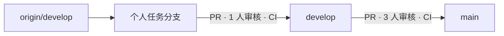
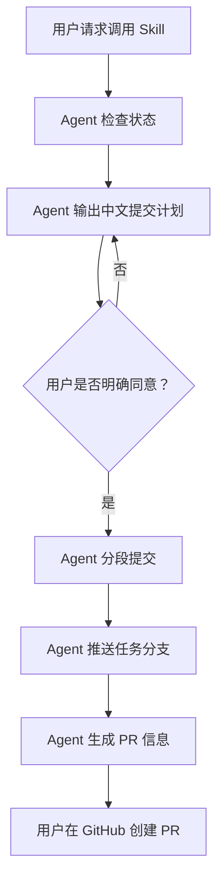
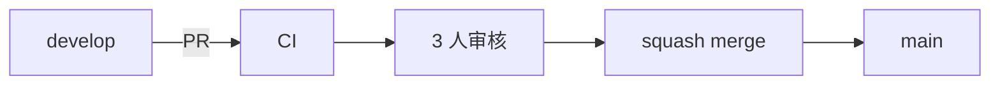

# QandA Git 项目开发与管理手册

> 面向 QandA 开发成员的 Git 工作流说明。
> 本手册帮助新成员接入项目，也为日常开发、提交、PR、发布和问题排查提供统一做法。

---

## 目录

- [1. 日常速查](#1-日常速查)
- [2. 核心规则](#2-核心规则)
- [3. Git Workflow Skill](#3-git-workflow-skill)
- [4. 第一次接入项目](#4-第一次接入项目)
- [5. 创建任务分支](#5-创建任务分支)
- [6. 分段提交](#6-分段提交)
- [7. 推送与创建 PR](#7-推送与创建-pr)
- [8. develop 发布到 main](#8-develop-发布到-main)
- [9. 常见问题排查](#9-常见问题排查)
- [10. 完整流程示例](#10-完整流程示例)

---

# 1. 日常速查

日常开发只需要记住一条主线：

```text
最新 develop
    ↓
个人任务分支
    ↓ PR + 1 人审核 + CI
develop
    ↓ PR + 3 人审核 + CI
main
```

GitHub 支持 Mermaid 时，可以直接查看下面的流程图：



## 常用命令

```bash
git fetch origin --prune
git switch develop
git pull --ff-only origin develop

git switch -c <gitname>/<type>/<description>

git status
git diff

git add <文件>
git diff --cached
git diff --cached --check

git commit -m "type(scope): 中文描述"

git push -u origin <当前分支>
```

## 日常工作顺序

1. 从最新 `develop` 创建个人任务分支
2. 开发并检查改动
3. 调用 `git-workflow` Skill
4. 按逻辑拆分 commit
5. 推送当前任务分支
6. 创建 PR 到 `develop`
7. 等待 **1 人审核 + CI**
8. 使用 squash merge
9. 删除已合并的任务分支

## PR 规则速查

| PR 类型 | 来源 | 目标 | 审核要求 |
|---|---|---|---:|
| 任务 PR | 个人任务分支 | `develop` | 1 人 |
| 发布 PR | `develop` | `main` | 3 人 |

---

# 2. 核心规则

## 2.1 分支规则

每项任务都创建一条短期个人任务分支。

分支必须从最新的 `origin/develop` 创建：

```bash
git fetch origin --prune
git switch develop
git pull --ff-only origin develop
```

然后创建任务分支：

```bash
git switch -c <gitname>/<type>/<description>
```

命名格式：

```text
gitname/type/description
```

示例：

```text
zhouycheng/feat/add-question-filter
zhouycheng/fix/question-state
zhouycheng/docs/update-git-guide
```

允许的 `type`：

```text
feat
fix
chore
docs
test
refactor
build
ci
```

命名要求：

- `gitname` 使用 GitHub 用户名；
- `description` 使用小写英文、数字和短横线；
- 不使用中文、空格或下划线；
- 不在 `main` 或 `develop` 上直接开发；
- 任务分支合并后删除。

---

## 2.2 Commit 规则

Commit 信息格式：

```text
type(scope): 中文描述
```

示例：

```text
feat(question): 增加多选题答题状态
fix(question): 修复题目状态更新
docs(workflow): 补充分支使用说明
test(question): 增加题目状态测试
```

一个 commit 应只表达一个独立逻辑。

推荐按职责拆分：

```text
docs(...)
test(...)
feat(...) / fix(...)
refactor(...)
```

避免：

- 一个 commit 混入多个无关功能；
- 功能修改和大面积格式化混在一起；
- 临时文件、构建产物、调试文件进入提交；
- 为了增加 commit 数量而拆分强关联代码。

提交前至少检查：

```bash
git diff --cached
git diff --cached --check
```

---

## 2.3 PR 与分支保护规则

### 任务分支进入 develop

```text
个人任务分支
    ↓ PR
develop
```

要求：

- 必须通过 PR；
- 必须通过 CI；
- 必须解决所有 PR 对话；
- 需要 1 个有效审核；
- 新提交导致旧审核失效时，需要重新审核；
- 合并使用 squash merge。

### 发布分支

```text
develop
    ↓ PR
main
```

要求：

- 来源必须是 `develop`；
- 需要 3 个有效审核；
- 必须通过 CI；
- 所有 PR 对话必须解决；
- 合并使用 squash merge。

### 保护规则

`main` 和 `develop`：

- 禁止直接推送；
- 禁止强制推送；
- 禁止删除；
- 管理员不能绕过保护规则。

> [!IMPORTANT]
> 个人任务分支不能直接合并到 `main`。

---

# 3. Git Workflow Skill

`git-workflow` Skill 是给 Agent 读取的 Git 执行规则。

它用于在提交和推送前：

- 检查当前工作区；
- 检查当前分支；
- 检查 upstream；
- 检查冲突和远程同步状态；
- 检查任务分支命名；
- 分析改动；
- 按逻辑职责拆分 commit；
- 生成中文提交计划；
- 在用户确认后执行提交和推送；
- 生成 PR 标题和正文。

它不负责：

- 绕过 GitHub 分支保护规则；
- 在用户没有明确同意时写入 Git 历史；
- 自动创建 PR。

---

## 3.1 常用调用方式

### 检查并准备提交

```text
请调用 git-workflow skill，检查当前工作区并准备提交。
```

### 生成分段提交计划

```text
请使用 .agents/skills/git-workflow/SKILL.md，
检查当前分支、远程同步状态和工作区改动，
并生成中文分段提交计划。
```

### 只检查，不修改

```text
请调用 git-workflow skill，只检查工作区和远程同步状态，
不要修改、暂存、提交或推送。
```

### 确认后提交并推送

```text
我同意这个提交计划，请调用 git-workflow skill，
按计划创建 commit 并推送当前分支，
然后生成 PR 标题和正文。
```

### 只生成 PR 信息

```text
请调用 git-workflow skill，检查当前分支和提交状态，
生成目标为 develop 的中文 PR 标题和正文，
不要创建 PR。
```

---

## 3.2 标准交互流程



---

# 4. 第一次接入项目

如果第一次接触 Git，可以先理解这些概念。

| 概念 | 简单理解 |
|---|---|
| 仓库 | 项目文件和历史记录的集合 |
| 远程仓库 | GitHub 上团队共享的仓库 |
| 工作区 | 当前正在编辑的文件 |
| 暂存区 | 准备进入下一次 commit 的改动 |
| commit | 一次有说明的历史记录 |
| 分支 | 一条独立开发线路 |
| PR | 请求把一个分支的改动合并到另一个分支 |

---

## 4.1 检查 Git

```bash
git --version
```

看到版本号表示 Git 已可使用。

---

## 4.2 配置身份信息

```bash
git config --global user.name "你的姓名"
git config --global user.email "你的邮箱"

git config --global --list
```

邮箱应使用 GitHub 认可的邮箱。

---

## 4.3 克隆项目

```bash
git clone https://github.com/zhouycheng/QandA.git
cd QandA
```

检查远程仓库：

```bash
git remote -v
```

检查分支：

```bash
git branch -a
```

正常情况下应看到：

```text
main
develop
```

以及对应远程分支。

---

## 4.4 确认 Agent 可以调用 Skill

```text
请调用 git-workflow skill，
检查我刚克隆的 QandA 仓库状态。
```

---

# 5. 创建任务分支

每项任务都从最新的 `develop` 开始。

## 5.1 更新远程信息

```bash
git fetch origin --prune
```

## 5.2 切换到 develop

```bash
git switch develop
```

## 5.3 同步 develop

```bash
git pull --ff-only origin develop
```

> [!WARNING]
> 如果 `git pull --ff-only` 失败，不要继续开发，也不要强行覆盖历史。
>
> 先查看 Git 提示，再让 Agent 检查当前分支关系。

## 5.4 创建任务分支

```bash
git switch -c zhouycheng/feat/add-question-filter
```

检查：

```bash
git branch --show-current
git status
```

---

## 5.5 开发过程中检查变化

```bash
git status
git diff
git diff --stat
```

其中：

- `git status`：查看修改、未跟踪、已暂存文件；
- `git diff`：查看尚未暂存的具体变化；
- `git diff --stat`：快速查看改动范围。

> [!TIP]
> 如果发现不属于当前任务的改动，不要直接提交，先确认来源。

---

# 6. 分段提交

提交不是“保存按钮”。

一个任务可以包含多个 commit，但每个 commit 应当代表一个明确、独立、可理解的逻辑。

例如一个任务包含：

```text
1. docs(workflow): 补充分支使用说明
2. test(question): 增加题目状态测试
3. fix(question): 修复题目状态更新
```

---

## 6.1 手动创建一个 commit

选择本次提交的文件：

```bash
git add docs/git-workflow.md
```

检查暂存区：

```bash
git diff --cached
git diff --cached --check
```

提交：

```bash
git commit -m "docs(workflow): 补充分支使用说明"
```

然后按同样方式继续处理测试、功能或重构代码。

---

## 6.2 让 Agent 规划 commit

```text
请调用 git-workflow skill，
检查当前工作区，
分析改动并用中文生成分段提交计划。
```

标准流程：

```text
检查状态
  ↓
分析改动
  ↓
生成提交计划
  ↓
用户确认
  ↓
暂存
  ↓
提交
  ↓
推送
```

用户明确同意前，Agent 不执行暂存、创建 commit 或推送。

---

# 7. 推送与创建 PR

第一次推送当前任务分支：

```bash
git push -u origin zhouycheng/feat/add-question-filter
```

以后继续推送：

```bash
git push
```

---

## 7.1 创建任务 PR

在 GitHub 中：

1. 打开 QandA 仓库；
2. 选择当前任务分支；
3. 点击创建 Pull Request；
4. 确认目标分支为 `develop`；
5. 确认来源分支符合 `gitname/type/description`；
6. 填写中文标题和 Summary；
7. 等待 `allowed-branch-flow` 和其他 CI；
8. 请求 2 名成员审核；
9. 根据审核意见修改并再次推送；
10. 满足条件后使用 squash merge；
11. 删除已合并任务分支。

---

## 7.2 PR 标题

格式：

```text
type(scope): 中文描述
```

示例：

```text
feat(question): 增加题目筛选功能
```

---

## 7.3 PR 正文

推荐格式：

```markdown
## Summary

- 改动了什么；
- 为什么需要改；
- 关联的 issue 或设计文档。

## Notes

- 仅在存在迁移、兼容性、风险、截图或特殊决策时填写；
- 没有内容时删除本章节。
```

普通 PR 不需要填写：

- Verification；
- 完整文件列表；
- commit 列表；
- 文档列表；
- 通用回滚说明。

---

# 8. develop 发布到 main

当 `develop` 达到稳定发布条件时，创建：

```text
develop
    ↓
PR
    ↓
main
```

发布 PR 要求：

- 来源必须是 `develop`；
- 目标必须是 `main`；
- 通过 `allowed-branch-flow` 和其他 CI；
- 获得 3 个有效审核；
- 所有 PR 对话已解决；
- 不包含尚未准备发布的任务。

流程：



> [!IMPORTANT]
> `main` 是稳定分支。
>
> 新任务仍然从最新的 `develop` 创建，而不是从 `main` 创建。

---

# 9. 常见问题排查

| 现象 | 原因与处理 |
|---|---|
| 推送 `main` 或 `develop` 被拒绝 | 这是保护规则正常生效。创建任务分支并通过 PR 合并。 |
| 没有 upstream | 第一次推送使用 `git push -u origin <当前分支>`。 |
| 分支落后远程 | 先停止提交并检查远程更新，不要强行覆盖。 |
| 分支与远程分叉 | 保留现场，让 Agent 检查分叉关系，不要直接 rebase 或 reset。 |
| PR 无法比较 | 确认任务分支已推送，并确认目标分支为 `develop`。 |
| 分支名不符合规则 | 按 `gitname/type/description` 重建任务分支。 |
| CI 失败 | 打开失败检查，修复真实问题后重新提交和推送。 |
| 审核数量不足 | 任务 PR 需要 1 人；`develop → main` 需要 3 人。 |
| 新提交后审核失效 | 这是保护规则正常行为，需要重新审核。 |
| 提交了临时文件 | 用 `git status` 和 `git diff` 检查，再按项目规则处理。 |

---

## 遇到错误时的安全检查顺序

先执行：

```bash
git status
git branch --show-current
git branch -vv
git log --oneline --decorate -n 5
```

然后再判断应该怎么处理。

> [!CAUTION]
> 在不清楚分支关系时，不要直接执行：
>
> ```bash
> git push --force
> git reset --hard
> git merge
> git rebase
> ```

---

# 10. 完整流程示例

下面是一名新成员从接入项目到创建 PR 的完整最短路径。

## 克隆项目

```bash
git clone https://github.com/zhouycheng/QandA.git
cd QandA
```

## 更新 develop

```bash
git fetch origin --prune

git switch develop
git pull --ff-only origin develop
```

## 创建任务分支

```bash
git switch -c zhouycheng/feat/add-question-filter
```

## 开发完成后检查

```bash
git status
git diff
```

## 请求 Agent 检查并规划提交

```text
请调用 git-workflow skill，
检查当前工作区，
分析改动并用中文生成分段提交计划。
```

## 用户确认计划后提交

Agent 按计划：

```text
暂存
→ 检查
→ commit
→ 继续下一组改动
```

## 推送任务分支

第一次：

```bash
git push -u origin zhouycheng/feat/add-question-filter
```

后续：

```bash
git push
```

## 创建 PR

```text
任务分支
    ↓
PR → develop
    ↓
1 人审核 + CI
    ↓
squash merge
```

发布时：

```text
develop
    ↓
PR → main
    ↓
3 人审核 + CI
    ↓
squash merge
```

---

# 文档与规则来源

开发者阅读规则：

```text
docs/git-workflow.md
```

Agent 执行规则：

```text
.agents/skills/git-workflow/SKILL.md
```

两者职责不同：

| 文件 | 面向对象 | 作用 |
|---|---|---|
| `docs/git-workflow.md` | 开发者 | 项目 Git 工作流和团队协作规则 |
| `.agents/skills/git-workflow/SKILL.md` | Agent | 提交、推送、检查和 PR 信息生成的执行规则 |

团队沟通内容统一使用中文。

---

> 文档版本：2026 年 9 月
> 适用项目：QandA
